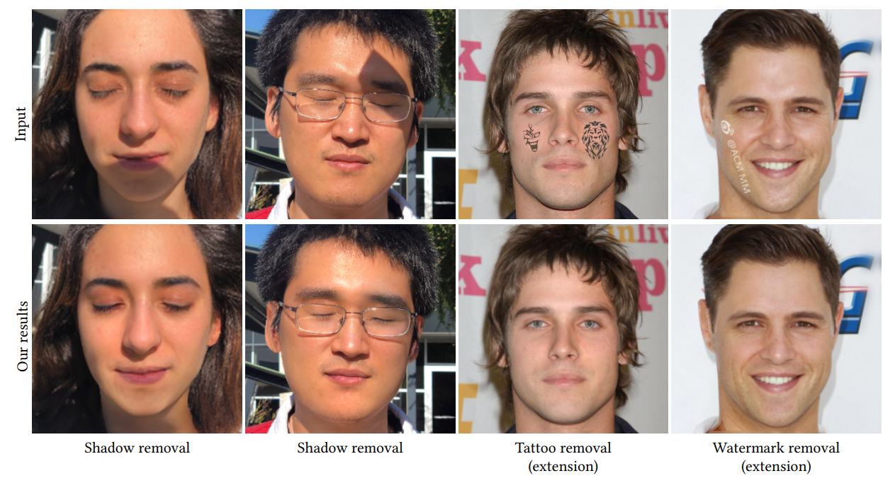
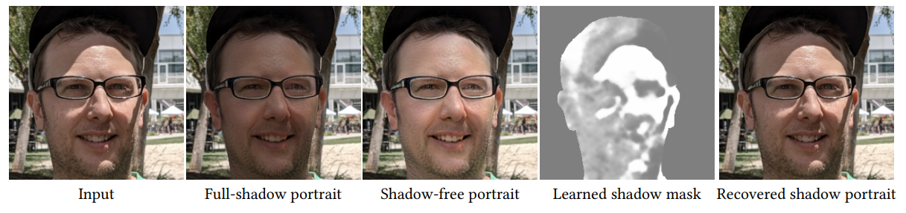

# ShadowGP

This is a fork of [Yingqing He's Repo]https://github.com/YingqingHe/Shadow-Removal-via-Generative-Priors/tree/main

**This repository provides the official codes for our paper: [Unsupervised Portrait Shadow Removal via Generative Priors (ACM MM 2021)](https://arxiv.org/abs/2108.03466).** 
> **Unsupervised Portrait Shadow Removal via Generative Priors** <br>
>  Yingqing He*, Yazhou Xing*, Tianjia Zhang, Qifeng Chen (* indicates joint first authors)<br>
>  HKUST <br>

<!-- [[Paper](https://arxiv.org/abs/2108.03466)]  -->
<!-- [[Project Page (Coming soon)](TBA)]
[[Technical Video (Coming soon)](TBA)] -->


In this repository, we propose an unsupervised method for portrait shadow removal, named as ShadowGP. ShadowGP can recover a shadow-free portrait image via single image optimization, without a large paired training dataset, which is expensive to collect and time-consuming to train. Besides, our method can also be extended to facial tattoo removal and watermark removal tasks.   

<!-- **Figure:** *Our results* -->
<!-- <br />     -->
ShadowGP can decompose the **single input shadowed portrait image** into **3 parts: a full-shadow portrait, a shadow-free portrait and a shadow mask**. Blending the three parts together can reconstruct the input shadowed portrait. The decomposed shadow-free portrait is the target output.  

<!-- **Figure:** *Our unsupervised method takes a single shadow portrait as input and can decompose it into a shadow-free portrait image, a full-shadow portrait image, and a shadow mask* -->


<br />

## Running in Colab
To install dependencies, download checkpoints, and run the model from Colab, open `shadowgp_colab.ipynb` from Google Colab. The cells in this notebook clone the rest of this repo and run all of the necessary setup.

## Install Environment, Download Checkpoints, and Download Dataset
Running the following commands will install a conda environment for Linux systems and download the pretrained checkpoints and evaluation dataset:

```
sh install_conda.sh   # If conda not installed
source setup.sh
```

## Run
```
bash run.sh
```
Then it will create a `results` folder including all the intermidiate results and the final output results in `results/res`.
<br />

## Acknowledgement
Our code is built on [StyleGAN2-PyTorch](https://github.com/rosinality/stylegan2-pytorch).


<br />

## Citation

```
@inproceedings{he21unsupervised,
  title     = {Unsupervised Portrait Shadow Removal via Generative Priors},
  author    = {He, Yingqing and Xing, Yazhou and Zhang, Tianjia and Chen, Qifeng},
  booktitle = {ACM International Conference on Multimedia (ACM MM)},
  year      = {2021}
}
```
